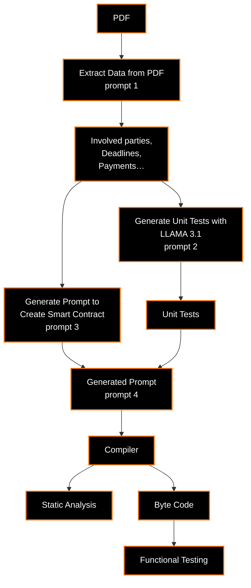

# LLMAZING-Contracts

# *Data Extraction and Unit Test Generation for Smart Contracts*

## Description

This project aims to extract data from a PDF file containing a contract, use the LLAMA 3.1 model with Ollama to generate unit tests for a Solidity smart contract, prepare a prompt, generate a Solidity smart contract, and test the generated contract using the unit tests. The project is divided into two parts: a frontend built with React.js and a backend implemented in Python.

## Project Structure
```
/root
    ├── frontend/  # Contains the React.js code for the user interface
    ├── backend/ # Contains the Python code for data extraction and smart contract generation
    ├ README.md 
```

## Features

- **PDF Data Extraction**: Extracts relevant information from a contract PDF file.
- **Unit Test Generation**: Uses the LLAMA 3.1 model to generate unit tests based on the contract's specifications.
- **Smart Contract Generation**: Creates a Solidity smart contract from extracted data and prepared prompts.
- **Automated Testing**: Executes unit tests to verify the functionality and security of the generated smart contract.

## Technologies Used

- **React.js**: For building the user interface.
- **Python**: For backend data processing, extraction, and contract generation.
- **Ollama**: To interact with the LLAMA 3.1 model.
- **Solidity**: For smart contract development.


## Workflow

## Frontend Overview

The `frontend` directory contains the React.js application, which provides a user-friendly interface for interacting with the project. Users can upload PDF files containing contracts, view extracted data, and initiate the unit test generation process. The frontend communicates with the backend to fetch results and display them to the user. Descriptions and installation instructions for the frontend can be found in the `frontend` folder's README file.

## Backend Overview

The `backend` directory includes Python scripts responsible for extracting data from the PDF contracts, generating Solidity smart contracts, and utilizing the LLAMA 3.1 model to create unit tests. This part of the application handles the core logic, processes the input data, and manages interactions between different components of the system. Descriptions and installation instructions for the backend can be found in the `backend` folder's README file.


## Mock UI Design

We have created a detailed mock UI for the application to visualize the design and user flow. You can view the Figma mock UI by clicking the link below:

[Figma Mock UI Design](https://www.figma.com/design/X49XkPGx7W36ockNxNleHI/Untitled?node-id=0-1&node-type=canvas&t=avNTpbl3MDMu6jox-0)

This mock UI showcases the layout, components, and interactions within the application, providing an overview of the user experience. Feel free to explore the design and provide any feedback or suggestions.

## Team Members 
*Ordered Alphabetically*

[@Andre Valentin](https://gitlab.tech.orange/valentin.andre), [@Billy Nicolas](https://gitlab.tech.orange/nicolas.billy), [@Daspe Etienne](https://gitlab.tech.orange/etienne.daspe), [@Erwann Taupin](https://gitlab.tech.orange/erwann.taupin), [@Ghayth Farhat](https://gitlab.tech.orange/ghayth.farhat), [@Giraud Jerome](https://gitlab.tech.orange/jerome.giraud), [@Hatin Julien](https://gitlab.tech.orange/julien.hatin), [@Juliette Cantais](https://gitlab.tech.orange/juliette.cantais), [@Moez Hachicha](https://gitlab.tech.orange/moez.hachicha), [@Salma Bradai](https://gitlab.tech.orange/salma.bradai)